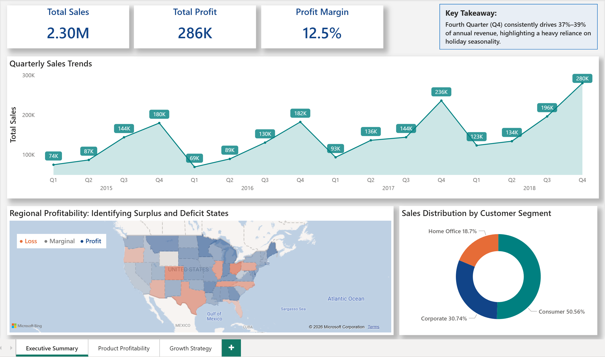
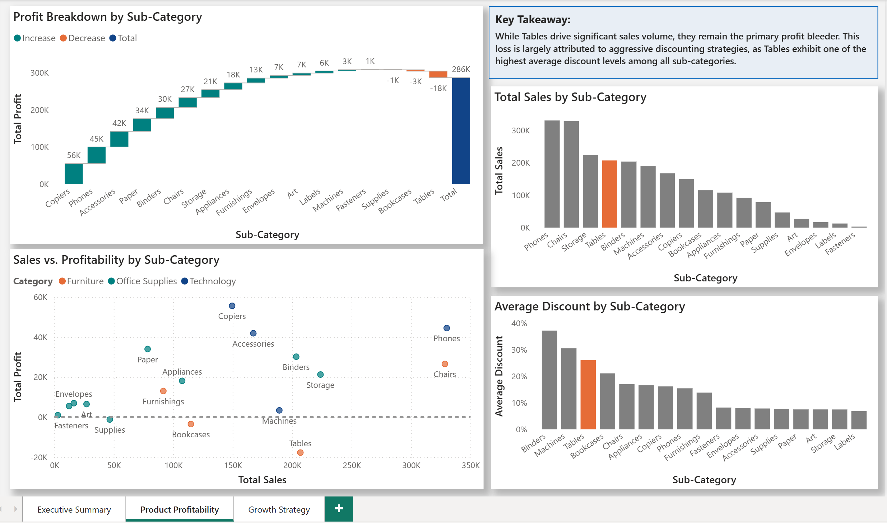
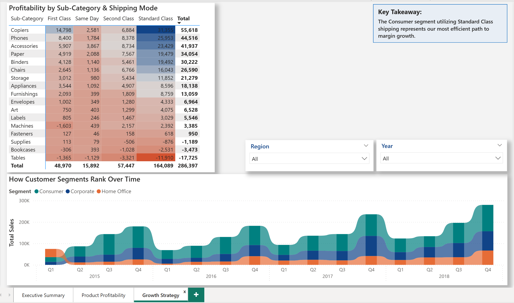

# Superstore Strategic Performance: From Loss Detection to Growth Strategy  
  
  
  
### **Project Overview**  
  
This 3-page interactive dashboard transforms raw retail data into a strategic roadmap. It moves beyond high-level KPIs to identify specific "profit bleeders" and prescribes actionable growth paths.   
  
  
  
---  
  
  
  
## **The 3-Page Story**  
  
  
  
### **1. Executive Summary**  
  
High-level overview of sales trends (2.30M) and seasonal Q4 spikes.  
  
  
  
  
  
  
  
---  
  
  
  
### **2. Product Profitability (The Deep Dive)**  
  
A diagnostic view isolating **Tables** as the primary profit bleeder, driven largely by aggressive discounting strategies.  
  
  
  
  
  
  
  
---  
  
  
  
### **3. Growth Strategy (The Action)**  
  
An operational analysis identifying **Consumer segment + Standard Class shipping** as the most efficient path to margin growth.  
  
  
  
  
  
  
  
---  
  
  
  
## **Tools Used**  
  
* **Power BI:** Data visualization and UI/UX design.    
  
* **Power Query:** Data cleaning and transformation.    
  
* **DAX:** Created measures for foundational KPIs (Total Sales, Total Profit, Profit Margin) and a diagnostic measure (Average Discount) to support the analytical narrative.  
  
  
  
---  
  
  
  
## **Data Source**  
  
[Sample Superstore dataset](https://www.kaggle.com/datasets/keyizhang14/superstore)
